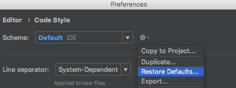
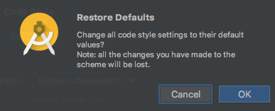
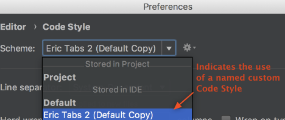

# ANDROID TUTORIAL, TEMPLATE APP PROJECT

[Switch to pre-androidx branch](https://github.com/raywenderlich/{{ cookiecutter.repo_name }}/tree/pre_androidx)

## SUMMARY

This project is a barebones Android Studio project that implements the code style and formatting standards for raywenderlich.com Android Tutorial Sample Projects.

The items implemented are:

- Correct format for the package name
- An RW launcher icon
- A customized RW Splash screen
- A specific RW code style
- A specific RW copyright profile

## HOW TO USE THE TEMPLATE APP PROJECT

Download {{ cookiecutter.repo_name }}.zip from this repository and use that. Tutorial sample projects should not include a git repo, so _please do not_ clone this repo and then start making modifications as the sample project. 

After downloading and unzipping the template project, you need to make a few edits and also set up your Code Style.

### ANDROID STUDIO CODE STYLE

**IMPORTANT:** Android Studio allows editing the default code style at the IDE-level, even creating your own "named" IDE-level code style profiles. If you have a modified `Default` IDE-level profile in your Android Studio or if you use your own "named" IDE-level code style profile and you open this project, all project-level code style and copyright settings in this project will be removed and your own settings will be applied. 

To prevent this, please follow along with the following steps, depending on your scenario:

- Check to see if your `Default` IDE-level code style is modified: 

  - Open Android Studio with any project except this one. Then navigate to `Preferences>Editor>Code Style` and check if your code scheme has `Default` in **BLUE** color (this means it is modified).

    

  - If `Default` is modified (colored **BLUE**), then:

    - If you wish to save your code style changes, click on the cog icon and select `Duplicate`. Then, give this copy a meaningful name. Be sure to select the `Default` again because you are about to reset it!

    - After you've duplicated your changes (if you want to preserve them) or if you don't wish to preserve your changes, click on the cog icon and select `Restore Default`.

      

    - Next, accept the change.

      

    - Once done, you will see your Default is no longer colored **BLUE**.

      

- Check to see if you're using your own "named" IDE-level code style:
  
  - Open Android Studio with any project except this one. Then navigate to `Preferences>Editor>Code Style` and see if you are using a "named" IDE-level code style. If you have anything other than `Default` selected under "Stored in IDE", you are using a named IDE-level profile.

    

  - To temporarily stop using a "named" IDE-level profile, simply select `Default` to go back to using Android Studio's default. You can always switch back once you're done with your tutorial.

- Once you've either reset a `Default` code style or selected `Default` if you were using a custom profile, go ahead and open the template and all the project-level settings should remain intact.

### EDIT THE PROJECT TO MAKE IT YOUR OWN

Several pieces should be changed to unique values such that they are relevant to the tutorial under development, including:

- Go to the root of the project folder and delete `img` folder (this contains images which are shown here in the README.md and are not necessary in your tutorial.)

- Refactor the package name to match the sample app you are building (Instructions on how to do this [here](https://stackoverflow.com/questions/16804093/android-studio-rename-package)).

- Change the colors in `colors.xml` to whatever you want for your tutorial, however, you are encouraged to use the RW Color Scheme in this project unless your tutorial specifically needs to use something else.

- Rename the top-level directory to match your sample project name

- If you are planning to use git and GitHub to manage your sample project development, be sure to start with the .gitignore file on the Android Team Guide [here](https://www.raywenderlich.com/tutorial-team/android-team-guide). However, don't forget that once done, you sill need to package the Sample App (both starter and final) in a zip file that does not include any GIT artifacts!
